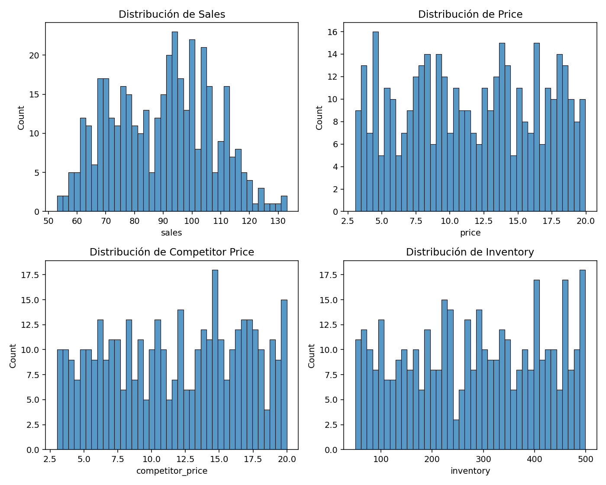

# Proyecto 6 — Sistema de Optimización de Precios Dinámico

Optimización de precios en una cadena retail (500+ tiendas) usando **forecasting**, **elasticidad**, **Q-Learning** y un **dashboard** operativo.  
Incluye **API** para integración con POS, **simulador de escenarios** y **reportes**.

## Entregables
1. **Motor de optimización de precios** → `src/models/` + `src/service/recommendation.py`  
2. **Dashboard de control de precios** →  https://8501-m-s-1j66xi4b4vrwq-b.europe-west4-0.prod.colab.dev  
3. **Simulador de escenarios** → `notebooks/evaluation/03_evaluation.ipynb`  
4. **API para integración con POS** → `api/app.py`, `api/routes/prices.py`, `api/schemas/`  
5. **Reportes de impacto financiero** → `docs/reporte_impacto_financiero.csv` (+ EDA en `docs/`)


## 📈 Resultados EDA y Evaluación


### EDA — Resumen global

|                  |   count |     mean |       std |   min |    50% |    max |
|:-----------------|--------:|---------:|----------:|------:|-------:|-------:|
| sales            |     400 |  88.8875 |  17.3305  | 53    |  91    | 133    |
| price            |     400 |  11.5932 |   4.90186 |  3.05 |  11.54 |  19.95 |
| competitor_price |     400 |  11.7673 |   4.95341 |  3.01 |  12.1  |  20    |
| inventory        |     400 | 282.13   | 133.495   | 50    | 287    | 499    |


### EDA — Top líneas por *sales* promedio

| product_line   |   sales_mean |
|:---------------|-------------:|
| Bebidas        |        90.44 |
| Lácteos        |        89.46 |
| Limpieza       |        89.05 |
| Snacks         |        86.83 |


### Top SKUs por ventas

| sku   |   sales_total |
|:------|--------------:|
| B     |          9378 |
| C     |          9261 |
| A     |          8954 |
| D     |          7962 |


### Top Tiendas por ventas

|   store_id |   sales_total |
|-----------:|--------------:|
|         20 |          1516 |
|         29 |          1463 |
|          2 |          1207 |
|         24 |          1198 |
|         21 |          1156 |


**Anomalías detectadas (|z|≥3):** 0 días


### Evaluación — Mejor escenario (por margen)

- **Precio óptimo (simulación):** `14.00`

- **Ingreso total estimado:** $465,477

- **Margen total estimado:** $299,235


**Escenarios evaluados:**

|   price |   total_revenue |   total_margin |
|--------:|----------------:|---------------:|
|       8 |          465477 |         174554 |
|      10 |          465477 |         232738 |
|      12 |          465477 |         271528 |
|      14 |          465477 |         299235 |


### Figuras EDA (añade estas imágenes a `docs/figures/` para que se muestren en GitHub)

```markdown



```


---

## ⚙️ Ejecución rápida

```bash
pip install -r requirements.txt
pip install -e .
# Dashboard
streamlit run dashboard/streamlit_app.py
# API
uvicorn api.app:app --host 0.0.0.0 --port 8000
```

## Notebooks (orden)
1) `notebooks/exploratory/01_exploratory.ipynb`  
2) `notebooks/modeling/02_modeling.ipynb` (por defecto `LINE_OBJ='Bebidas'`)  
3) `notebooks/evaluation/03_evaluation.ipynb`

## Licencia
MIT
